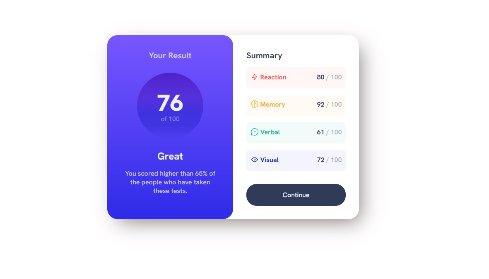
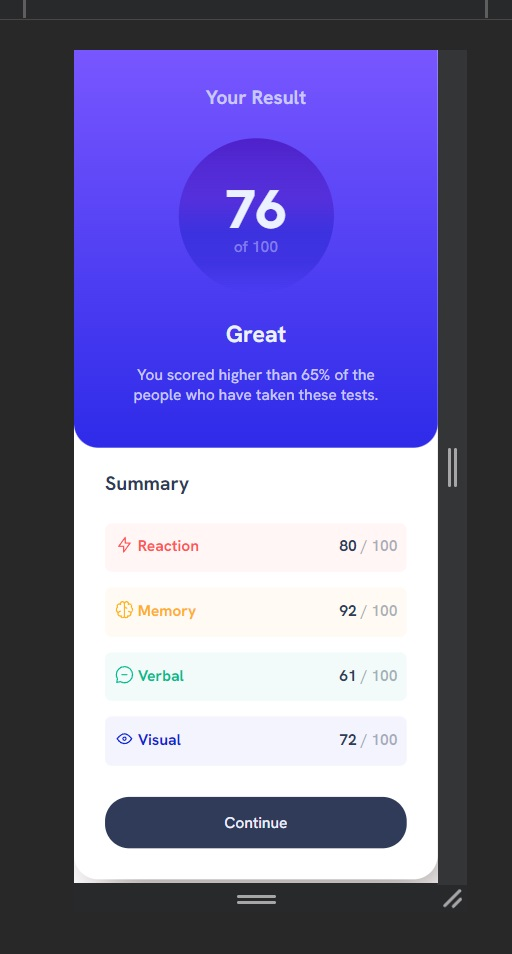

# Frontend Mentor - Results summary component solution

This is a solution to the [Results summary component challenge on Frontend Mentor](https://www.frontendmentor.io/challenges/results-summary-component-CE_K6s0maV). Frontend Mentor challenges help you improve your coding skills by building realistic projects.

## Table of contents

- [Overview](#overview)
  - [The challenge](#the-challenge)
  - [Screenshot](#screenshot)
  - [Links](#links)
- [My process](#my-process)
  - [Built with](#built-with)
  - [Useful resources](#useful-resources)

## Overview

### The challenge

Users should be able to:

- View the optimal layout for the interface depending on their device's screen size
- See hover and focus states for all interactive elements on the page
- **Bonus**: Use the local JSON data to dynamically populate the content

### Screenshot

### Links

- Solution URL: [Add solution URL here](https://grathienbeto.github.io/results-summary-component-FE-Mentor/)

## My process

### Built with

- Semantic HTML5 markup
- CSS custom properties
- Flexbox

### Useful resources

- [Linear gradient](https://developer.mozilla.org/en-US/docs/Web/CSS/gradient/linear-gradient) - Still working on my gradients.

## Author

- Frontend Mentor - [@yourusername](https://www.frontendmentor.io/profile/Grathienbeto)
- Twitter - [@yourusername](https://twitter.com/betoluna89)

**Note: Delete this note and add/remove/edit lines above based on what links you'd like to share.**
